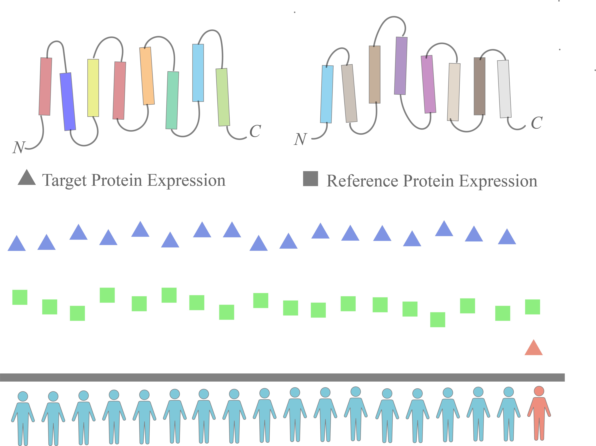

# IDEPA-XMBD: Individualized Differentially Expressed Protein Analysis

<div align=center></div>
&nbsp;


We evaluated five state-of-the-art tools (RankComp v1/v2, PenDA, Peng, and Quantile) through classic computational (precision, Type one error control, parameter evaluation, robustness, and similarity) and functional (pathway enrichment and survival analysis) criteria. We also integrated these tools into a user-friendly tool kit, IDEPA-XMBD , to facilitate individualized DEAs in proteomics studies.

A pre-print describing the method is available at bioRxiv: [Application of personalized differential expression analysis in human cancer proteome](https://www.biorxiv.org/content/10.1101/2021.07.18.452812v2)


## 1. Install
We use docker to encapsulate the command line version and the plotly version of IDEPA-XMBD separately.

### 1.1 Cmd Version
We provide a docker image with IDEPA-XMBD: https://registry.hub.docker.com/r/ychlouie/idepa_cmd

Pull the docker image of IDEPA-XMBD:
```shell
docker pull ychlouie/idepa_cmd:0.1
```

Create a docker container containing IDEPA-XMBD:
```shell
docker run -it ychlouie/idepa_cmd:0.1
```

### 1.2 Plotly Version
We provide a docker image with IDEPA-XMBD: https://hub.docker.com/r/lylan/idepa

Pull the image:
```shell
docker pull lylan/idepa:0.1
```

Create a docker container
```shell
docker run -it -d -p HostPort:8095 -v HostDirectory:/IDEPA/workdir lylan/idepa:0.1
```

Then, you can enter the IDEPA_plotly version by visiting `HostIP:HostPort`, and all output files will be saved in `HostDirectory`. For example: HostPort could be set to `38765`, HostDirectory could be set to `~/IDEPA`, HostDirectory must exist. These two parameters can be changed according to user needs.

such as,
```shell
mkdir ~/IDEPA

docker run -it -d -p 38765:8095 -v ~/IDEPA:/IDEPA/workdir lylan/idepa:0.1

```
Next, open `127.0.0.1:38765` in the local browser or remotely access `ip:38765` (you should ensure that the machine can be accessed remotely). 

The dependency of IDEPA-XMBD is: [environment](./environment.yml)

## 2. Usage
### 2.1 Cmd versioin
After entering the container `docker run -it ychlouie/idepa_cmd:0.1`, use `-h` to view the IDEPA-XMBD module information:
```shell
python /IDEPA-XMBD/individual_depa.py -h

# View specific module information 
python /IDEPA-XMBD/individual_depa.py [moduleName] -h

# such as
python /IDEPA-XMBD/individual_depa.py comparison -h 
```
`moduleName` is the name of the module you want to run 

We also provide example data for each module：
```shell
python /IDEPA-XMBD/individual_depa.py [moduleName] -p /IDEPA-XMBD/parameters_file/test_parameters.txt

## such as
python /IDEPA-XMBD/individual_depa.py stable -p /IDEPA-XMBD/parameters_file/test_parameters.txt

# Result workdir /IDEPA-XMBD/workdir
```

If you want to change the input data, you can change the content of `/IDEPA-XMBD/parameters_file/test_parameters.txt`

### 2.2 Plotly version

After entering the container, you can operate according to [Procedure](./procedure.pdf)

## 3. Cite this article

Liu Y, Lin Y, Yang W, et al. Application of individualized differential expression analysis in human cancer proteome[J]. Briefings in Bioinformatics, 2022.
